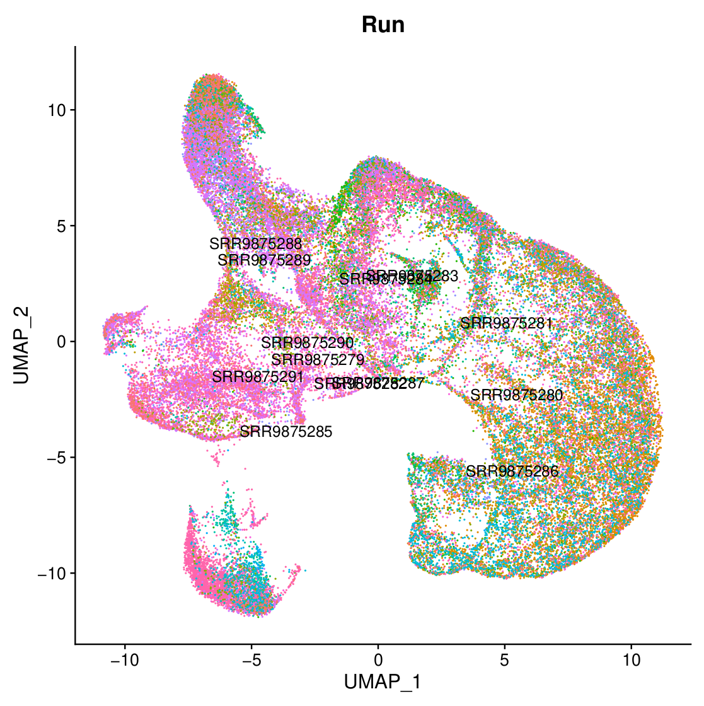
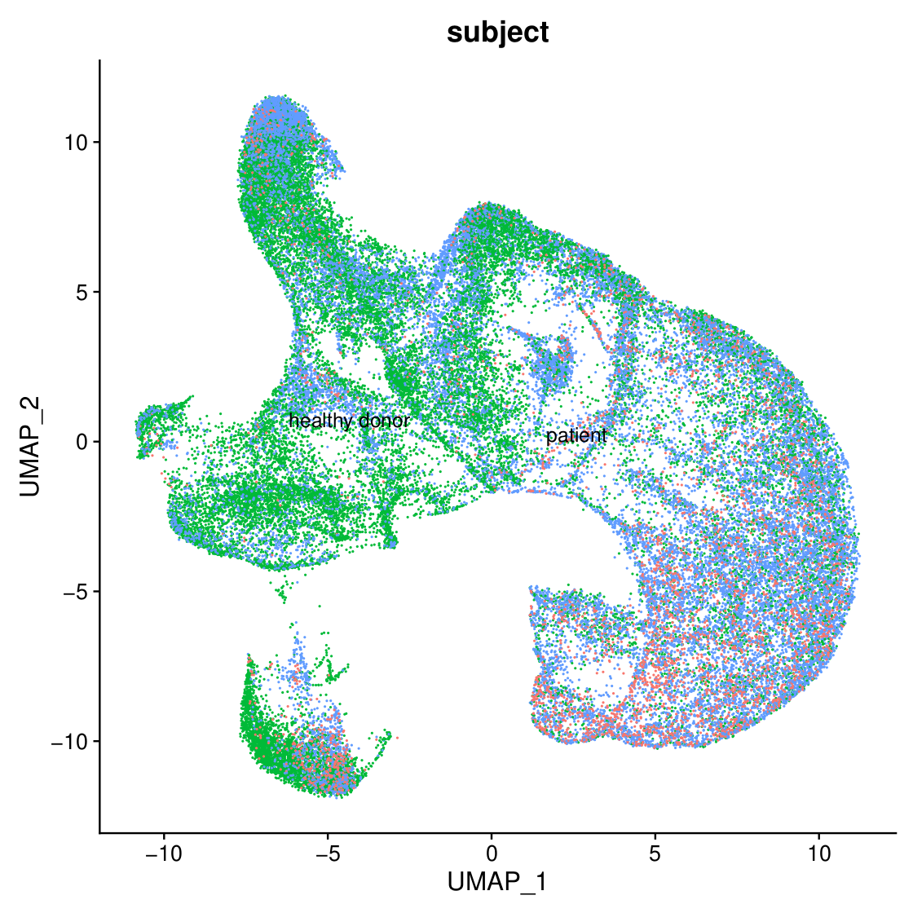
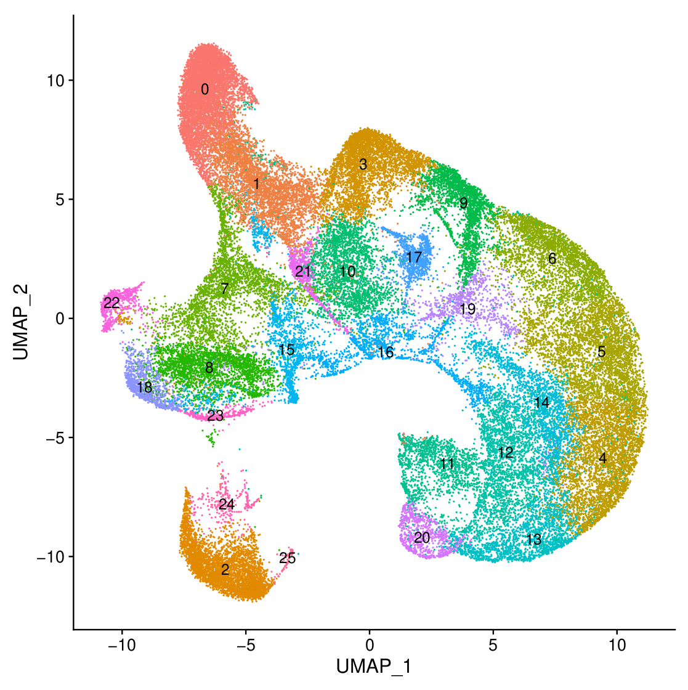
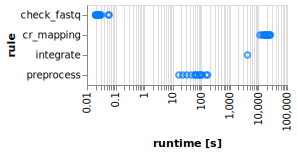

## What is it ?

A pipeline to process scRNAseq data from GEO datasets.

### Methodology


## Proof-of-concept: processing of GSE135194

Dataset source is [here](https://www.ncbi.nlm.nih.gov/geo/query/acc.cgi?acc=GSE135194): HSCPs from HD and GATA2 deficient patients.

### Outputs

Download, dump and mapping output tree is [here](proofs/proof_seq.txt). Postprocessing output is [here](proofs/proof_outs.txt).

Preprocess and integration outputs includes:





```bash
$ ll readCountMatrix_GSE135194.csv 
-r-------- 1 user user 3.9G Mar 25 18:03 readCountMatrix_GSE135194.csv

$ md5sum readCountMatrix_GSE135194.csv 
42adbbbc83618f3ae1eb21511c2ef5fc  readCountMatrix_GSE135194.csv
```

### Caveats

#### Dataset size

13 samples, there are potential issues during SRA download & dump (it could be necessary to download / dump seqfiles **again** in case of uncomplete / broken fastq, check any ERROR.log in the root directory, and start the pipeline again). Pipeline process peaks at more than **2 Tio** of storage: **watch out** any volumetric/storage issues.

#### Processing time

Preprocessing and mapping takes **5-6 hours** per sample.


